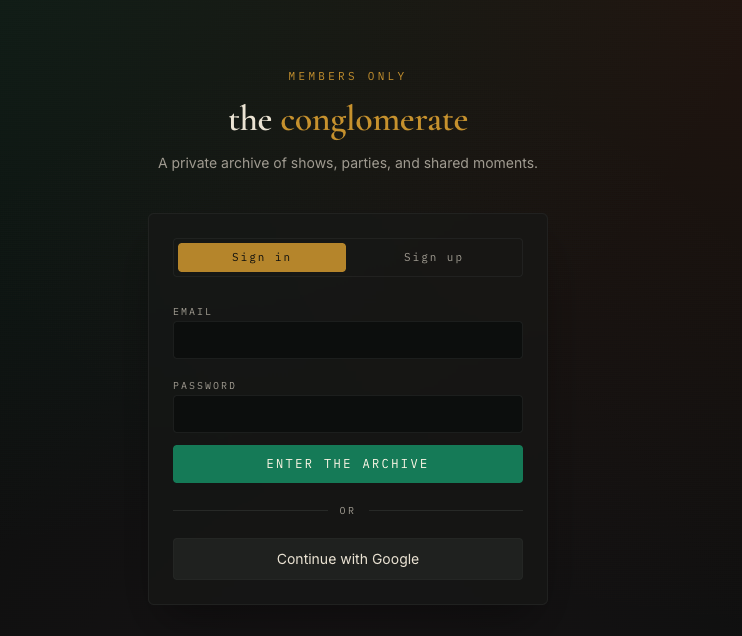
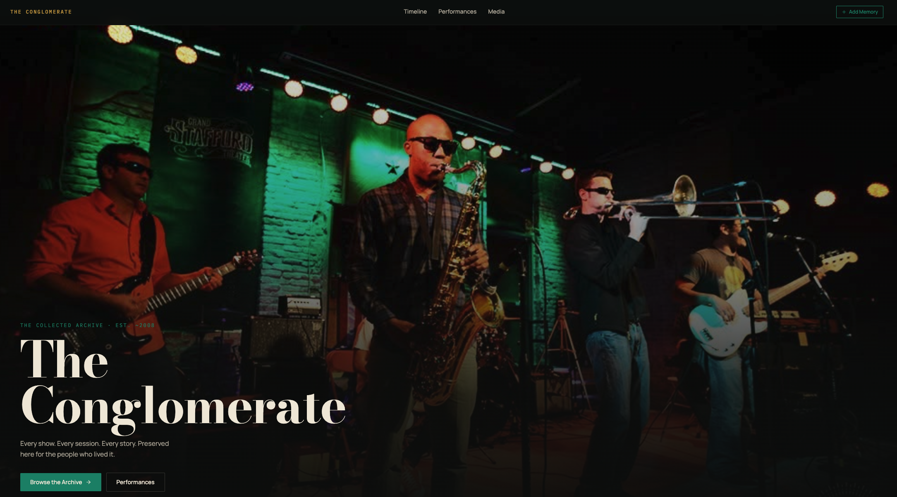
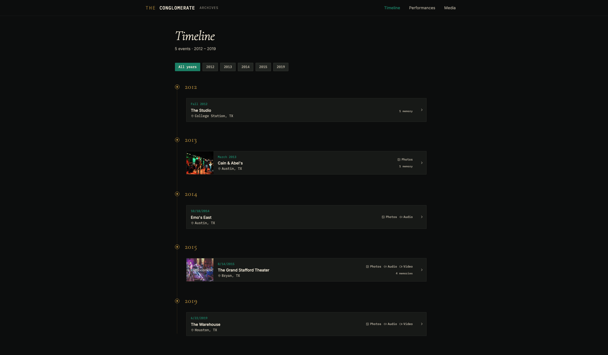
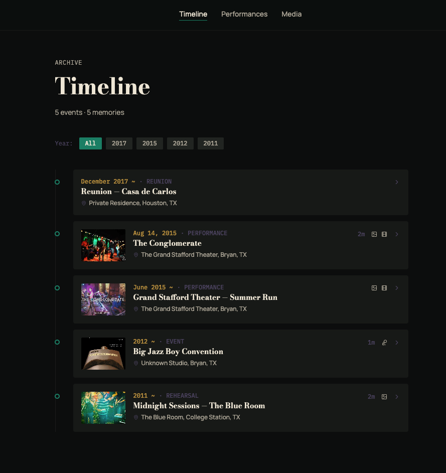
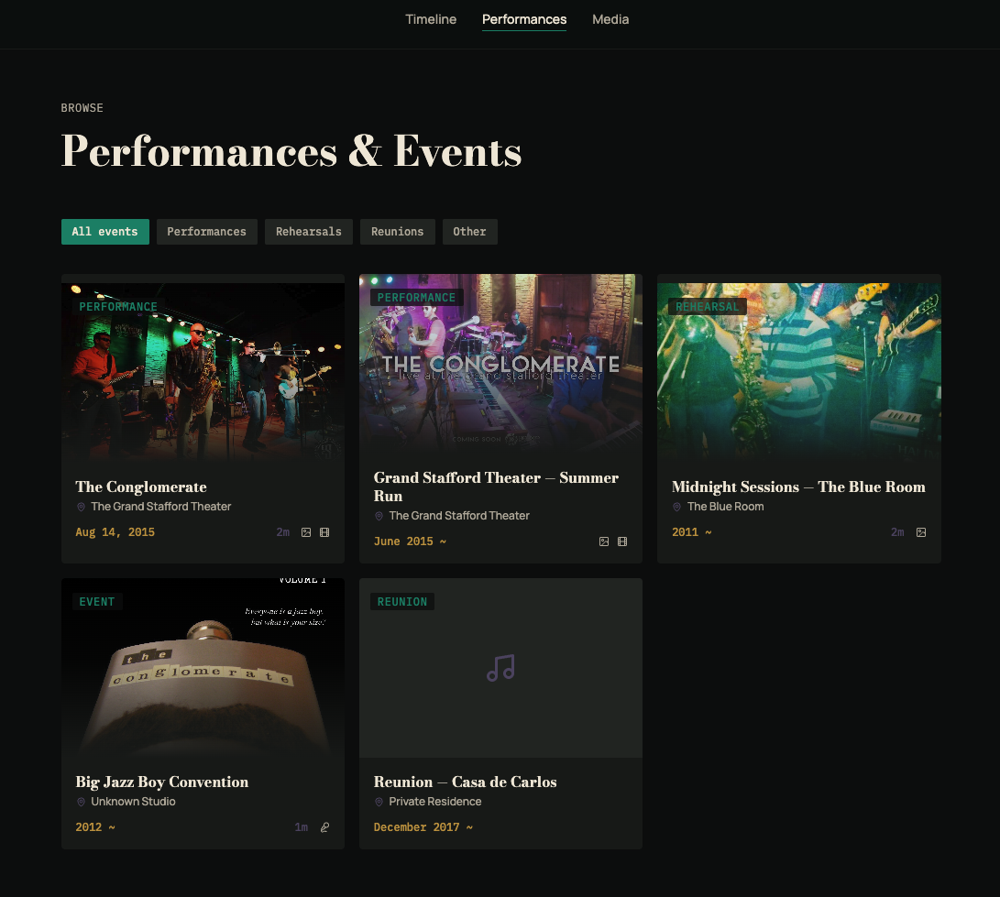
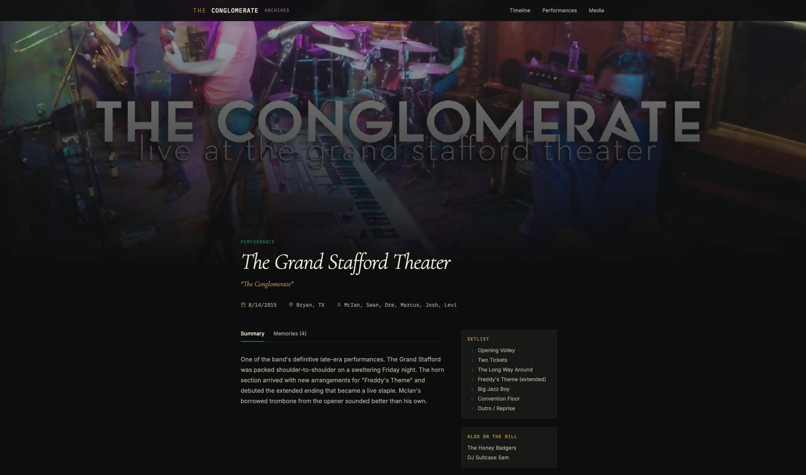
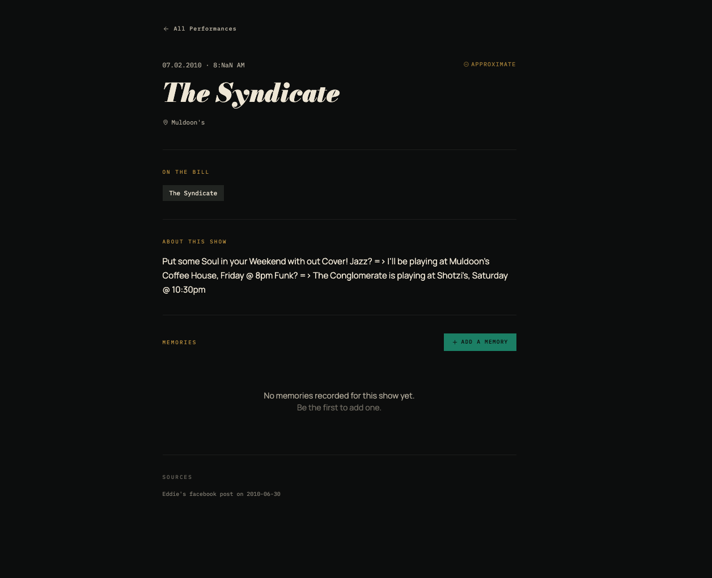

# Minimum Viable Product

# Overview

## Background

I was in a band with some dear friends of mine. We have a tremendous amount of live performances, parties, photos/videos, inside jokes, and memories that we'd like to document, celebrate, and memorialize.

Facebook and other social media sites are not good for this because posts are not evergreen: they disappear in the algorithm, the original content is not updated as new details are added. I'd like to build a similar but distinct solution for organization and presentation of all these shared memories, stories, and artifacts.

## Product Statement

A private chronological archive where band members can revisit shared moments, view related media and memories, and add attributed annotations that expand the collective record.

## Users and Permissions

### Member

- View all content
- Browse the timeline and media
- Add memories and annotations
- Upload/Assign media to events

### Editor

Everything a member can do, plus:

- Create, edit, delete timeline events
- Manage people and places

## Scope

The MVP data model supports multiple event types, but the initial imported content and initial UI will focus on performances.

### Non-goals

- No canonical song database
- No discography system
- No separate recording entity
- No rich people biographies
- No rich place pages
- No structured reference library
- No public access
- No public sharing links
- No reactions
- No notifications
- No automatic transcription
- No facial recognition
- No automatic person tagging
- No advanced search
- No maps
- No automatic video transcoding
- Mobile-first, Mobile-friendly, but no mobile application
- No artifact-specific permission system

# Site Map & Data Model

## Core Content

The content model is built around three core concepts:

```jsx
Event
Media
Annotation
```

Supporting entities:

```
User
Person
Place
```

**User:** Represents a editor or member with access to the platform. 

```jsx
User
- id
- email
- role
- person_id nullable
- is_deleted
- created_on
- modified_on
```

**Person:** Represents an individual we want to track through a series of events. This definitely includes the members of the band and all users of the platform, but can also include other musicians or people in our orbit. 

A `Person` should not grant access. A `User` should reference a `Person`.

```jsx
Person
- id
- display_name
- aliases
- biography fields
- is_deleted
- created_on
- modified_on
```

**Place:** Represents the location where an event happened. Place should include attributes like 

- Name
- Place type (restaurant, venue, residence, etc)
- Address (Can be exact address, or just city if address unknown)
- Status (active, closed, demolished, unknown)
- Is Deleted
- Created/Modified on

### Event

Represents anything that happened:

- Performance
- Party
- Rehearsal
- Recording session
- Reunion
- Other

Event schema:

```json
event
- id
- name
- event_type
- event_date
- event_time nullable
- date_precision
- place_id nullable
- summary
- confidence (low|medium|high)
- hero_image_id nullable (joins to media item)
- is_deleted
- created_on
- modified_on
```

For each event of every type, we want to corroborate with primary sources (e.g., a link to a facebook event, a screenshot of a social media post). Sources may be stored as event-level external links with a label and clickable URL if available. A structured reference library is out of scope.
```json
event_sources
- id
- event_id
- source_type (media|url|text)
- description
- url nullable
- media_id nullable (for screenshots)
```

For Performance-type events, we have performance specific fields:

```json
event_performance_details
- event_id
- billing_name nullable
- promotion_text nullable
- setlist_text nullable
- event_poster_id nullable (joins to media item)

UNIQUE(event_id)
```

We’ll also track the band members who performed with the band at that event:

```json
event_people
- event_id
- person_id
- relationship_type (performer|attendee|organizer|photographer|unknown)
- notes nullable
- is_deleted
- created_on
- modified_on

UNIQUE(event_id, person_id, relationship_type)
```

We’ll also track the other acts on the bill

```json
event_acts
- id
- event_id
- name
- billing_role (opener|headliner|unknown)
- created_on
- modified_on

UNIQUE(event_id, name)
```

### Media

Represents:

- Photo
- Video
- Audio
- Document
- External link

### Annotation

Represents an attributed memory or clarification attached to:

- An event
- A media item

The contribution can take the form of:

- a clarification
- a contradiction
- a memory
- analysis / interpretation

Songs, releases, recordings, references, lore, parties, and performances should not have separate implementation systems in the MVP.

### Use a two-layer narrative model

Use two layers on every performance or event page.

#### 1. Event summary

A curated account of what happened.

This might begin as a few sentences and grow as members contribute memories.

#### 2. Member memories (Annotations)

Short attributed observations, corrections, anecdotes, and context.

These are the raw materials from which the summary is constructed.

That gives you both:

- A readable, coherent historical account
- Preservation of the original contributions and voices

It also avoids turning the site into a series of disjointed comments.

#### Proposed annotation scheme

Keep the contribution form very lightweight:

```
What do you remember?

Who was involved?

Is this:
- Something you personally remember
- Something someone else told you
- A correction or clarification
- A quote or saying

Should this be incorporated into the event summary?
- Yes
- No preference
- Keep as a separate note
```

#### Some annotations may attach to media

Not every memory belongs only to the event as a whole.

For example:

- “This was taken right after Sean fell into the drumset.”
- “McIan borrowed that guitar from the opening band.”
- “This is the only recording where we played the slow ending.”

So annotations should be attachable to:

- A performance or event
- The photo
- The video
- An audio recording

Naming convention:

```
Database/entity: Annotation
UI label: Memory
Primary action: Add a memory
Section heading: Memories
```

Core Annotation schema

```
Annotation
  target_type (event|media)
  target_id
  body
  author_id
  annotation_type
```

Annotation Types:

```jsx
personal_memory / firsthand_account
secondhand_account
correction
quote
context
```

People may be mentioned through a join table:

```
annotation_people
```

Annotations directly on people or places is not in scope.

### Relationships

A core relationship model:

```
Event
  has People
  occurs at Place
  contains Media
  has Annotations

Media
  depicts People
  documents Events
  has Annotations
  
Annotation
	has Author
  mentions People
  concerns Events or Performances
```

## Site Map

For the minimum viable product, I would build only:

```
/
├── timeline/
├── events/
│   ├── events/[slug]
│   ├── new/
│   └── [slug]/edit/ (editor-only route)
├── performances/
├── media/
└── admin/ (editor-only route)
```

### 1. Home

```
/
```

The home page should present the project emotionally rather than functioning primarily as a database dashboard.

Sections:

- Project description
- Recently added content
- Timeline entry point

The homepage should answer:

1. What is this?
2. Who is it for?
3. Why does it exist?
4. Where should someone begin?

A possible framing:

> This is the collected history of the band, the shows, the parties, the recordings, the people, and the stories that grew around them.
> 

### 2. Timeline

```
/timeline
```

Represents a chronological list of all events including: Date, title, place, and media indicators

Users could filter it by:

- Year
- Person
- Event type
- Place

This lets the site feel like a coherent history rather than a collection of isolated databases.

### 2. Performances

```
/performances
/events/[slug]
```

Performances represent the only events we have to import first. The index can support:

- Chronological browsing
- Year filters
- Venue filters
- Era filters
- Personnel
- Available audio, video, photos, or setlists
- Known date versus approximate date
- Featured or historically significant performances

Each performance page should function as a container for everything connected to that event:

- Hero Image (either event_poster_id or hero_image_id, prefer hero_image_id if set)
- Title (Event name or billing name)
- Date and time
- Place
- People (Personel)
- Curated summary
- Other acts on the bill
- Sources
- Media gallery (Poster or flyer, Live audio, Live video)
- Audio/video playback
- Member memories
- Contribution action

### 3. Media

```
/media
```

This dashboard represents global discovery. Someone can browse all videos, search for a person, or filter for rehearsal recordings.

- browse by media type (Photos, Videos, Audio);
- filter by year;
- optionally filter by person;
- open related event.

Each media item can contain:

- Title
- Media type
- Date
- Approximate date
- Creator or uploader
- People shown or heard
- Place
- Related event
- Description
- Original file
- Display version
- Source or provenance

### 4. Admin

```jsx
/admin
```

- View change history
- User management
- Event management

# Workflows

### Authentication workflow

Cloudflare Access protects the entire application.

Approved users may authenticate using either:

- Continue with Google
- Email one-time PIN

Cloudflare Access validates the authenticated email address against an explicit allowlist. Possession of a Google account or access to an email address alone does not grant access unless that address is included in the Access policy.

The application does not implement passwords, registration, password resets, or account recovery.

After successful Access authentication, the application maps the authenticated email address to a local User record in D1. The local User record determines the application role and may additionally disable application access.

There will be no need for: a password field, a Sign-up option, or a Forgot-password flow.

### Browse workflow

```
Sign in
→ Open timeline
→ Filter or scroll
→ Open event
→ View event summary, data, media, and annotations
```

Acceptance Criteria:

- Events appear recently modified first by default `changed_on DESC`.
- Users can filter by year and event type.
- Approximate dates display without implying false precision.
- Each card shows media availability.
- The page works on mobile widths.

### Annotation workflow

```
Open event
→ Select “Add a memory”
→ Expands to reveal input form
→ Enter annotation data
→ Submit
→ Annotation becomes visible to all users
```

Acceptance Criteria:

- Annotation is flagged with user and date/time of creation
- New annotations show up immediately under the body of the event, newest first

### Annotation edit workflow

```
Open event
→ For annotations by the current user, "Edit memory” is available
→ User selects "Edit memory"
→ Opens modal
→ Edit annotation data
→ Submit
```

Acceptance Criteria:

- Only the user who created the annotation has the option edit/delete it
- All changes are tracked

### Media contribution workflow

```
Open event
→ Select “Add media”
→ Select files
→ Submit
→ Upload directly to R2
→ Media becomes visible to all users
```

Acceptance Criteria:

- A user can upload multiple files.
- Large files upload directly to R2.
- Failed uploads do not create published media.
- The application records filename, MIME type, size, uploader, and checksum.
- Files are saved to the corresponding event
- Media uploaded by authenticated members to an existing event is published immediately after the upload completes successfully and metadata validation passes.
- the uploader can delete their own upload.
- an editor can delete or unattribute any media.
- no hard deletion in normal UI.

# Data Rules

## Dates & Times

Events should have separate `event_date` & `event_time` fields. 

Event times should represent the event start time. Event end time is out of scope.

For date ambiguity, allow these precisions:

```jsx
exact
month
semester
year
approximate
unknown
```

Examples:

- `2011-05-14`, exact, displayed as “5/14/2011”
- `2011-05-01`, month, displayed as “May 2011”
- `2011-02-01`, semester, displayed as “Spring 2011”
- `2011-08-01`, semester, displayed as “Fall 2011”
- `2011-01-01`, year, displayed as “2011”
- `2011-05-14`, approximate, displayed as “Around 5/14/2011”
- unknown, displayed as “Unknown”

Always use Luxon presets where possible. Always use `DATE_SHORT` for exact dates - `DATETIME_SHORT`  when the event time is also known.

#### Deletion

- Normal UI uses soft deletion or `SET is_deleted = 1`
- Originals are not deleted through ordinary application actions

## Media

### Media Ownership

Every media item should have:

- One optional  event
- Zero or more tagged people
- Original filename
- R2 object key
- MIME type
- Size
- Checksum
- Status
- is deleted
- Created on / Created By

Avoid arbitrary many-to-many relationships until there is a demonstrated need.

Media statuses:

- uploading
- processing
- published
- failed

### Media Constraints

#### Images

- Preserve original
- Generate one display version
- Generate one thumbnail
- Correct orientation
- Support JPEG, PNG, WebP, and common phone formats where practical

#### Audio

Supported inline playback:

- MP3
- M4A/AAC
- WAV where browser-compatible

Other formats may be preserved as downloads.

#### Video

Supported inline playback:

- MP4 using browser-compatible codecs
- WebM where available

Do not promise playback of every archival format.

#### Upload limits

Set concrete limits, for example:

- Photos: 25 MB each
- Audio: 500 MB each
- Video: 2 GB each
- Documents: 100 MB each

These should be configurable rather than hard-coded throughout the application.

# Design and Styling

The site should feel like a **dark archival music space illuminated by live stage color**: black and charcoal foundations, warm ivory text, brass and emerald accents, and occasional orange, magenta, and violet highlights.

## Visual Direction

- Photo-led, cinematic, and archival rather than social-media-like
- Clean enough for long-term documentation, but playful enough to preserve inside jokes and band mythology
- Strong live photography should remain in full color and provide most of the visual energy
- Lower-quality archival images may use subtle grain, contrast correction, and dark framing

### Color Palette

- Background: `#080A09`
- Surface: `#171A18`
- Raised surface: `#242825`
- Primary text: `#F1E9DA`
- Secondary text: `#B7B0A2`
- Primary accent: Stage Emerald `#078A70`
- Secondary accent: Brass Gold `#C49A47`
- Warm accent: Burnt Orange `#C64C27`
- Optional atmospheric accents: Magenta `#8C4F78`, Violet `#554B69`

Use emerald for interactive states, brass for featured and archival emphasis, orange for high-energy actions, and magenta/violet sparingly.

### Typography

- Display/editorial: Cormorant Garamond or Bodoni Moda
- Main UI/body: Inter or Manrope
- Metadata/dates/setlists: IBM Plex Mono

Use clean sans-serif for navigation and content and monospace for archival metadata.

### Component Style

- Image-first cards with restrained dark surfaces and minimal shadows
- Modest corner radius, generally 4–8px
- Performance cards should show image, date, venue, and title clearly
- Memories should appear as liner-note-style annotations with a thin brass rule, not chat bubbles
- Lore content may use black-and-ivory layouts, serif type, and occasional cutout-label or flask motifs
- Avoid generic music-note icons, neon nightclub clichés, and feed-style layouts

### Brand Motifs

Use sparingly:

- brass instruments
- stage-light dots
- typewritten labels
- setlist paper
- cables and waveform-inspired dividers
- Freddy the flask and ransom-note lettering for lore or special sections only

### Overall Balance — Target approximately:

- 70% black, charcoal, and ivory
- 20% emerald and brass
- 10% orange, magenta, and violet

The final visual identity should read as:

> **A black archival structure interrupted by vivid pools of live color.**

## UI Reference Notes

Visual references are directional, not complete specifications. When references conflict, the written PRD and approved design-system rules take precedence.

When references conflict, use this order:

1. Functional and accessibility requirements
2. Written page-specific instructions
3. Approved design-system rules
4. Prototype screenshots

### Approved Patterns

- Dark vignette or bottom gradient over the hero image to preserve text contrast
- Simplified filters and menus on mobile
- Primary CTA uses the Stage Emerald design token
- Icons may supplement labels but must not replace meaningful text

### Patterns to Avoid

- Small body text. Standard sizes are preferred.
- Low-contrast secondary text against dark backgrounds

### Responsive Rules

- Desktop layouts may use right-side sidebars and expanded filters.
- Mobile layouts should collapse navigation and filters.
- Desktop sidebars must move into the normal content flow on narrow screens rather than becoming horizontally compressed.
- No text should become smaller than the design-system minimum body size.
- Icons must retain accessible labels.
- Important actions must remain visible without relying on hover.

### Page-Specific Prototypes

#### Sign in - Example



Use:
- Enter an email address to receive a one-time PIN
- Continue with Google

Avoid:
- "Sign up" option. Access is invite only.

#### Home - Example 1



Use:
- Main heading typography: heavy typeface, white or warm ivory, not italic
- Vignette effect

Avoid:
- "Add memory" in top navbar

#### Navbar Mobile


Use:
- Navigation links collapse into a hamburger menu
- 'The Conglomerate' brand or logo links to the home page

#### Timeline - Example 1



Use:
- Items are reverse chronological
- Items are separated by year
- Cards show the primary image where available
- Cards show relevant metadata
- Pill-style controls for each year

Avoid:
- Advanced filters; that is for a different page

#### Timeline - Example 2



Use:
- Items are reverse chronological
- Cards show the event type and other metadata

Avoid:
- Results not broken out by year
- Using icons with no context
- Displayed metadata includes the age of the record ("2m" for 2 minutes old)

#### Performances Dashboard



Use:
- Compact cards with primary image and metadata below, not overlaid.
- Fixed image aspect ratio
- Default image with none is set
- A search text box
- Filter dropdowns for venue, personnel, and lineup (Headliner vs Opener)
- Only a search text box on mobile

#### Performance Detail - Example 1



Use:
- Sidebar for setlist, other acts
- Icons and tags in the subtitle for date/time, location, and personnel
- Gradient into page content

Avoid:
- Avoid the thin or italicized main-heading typography shown here
- Placing memories in a separate tab
- Hiding sources behind a tab or secondary interaction

Memories should appear below the event summary. Sources should appear in a final section below Memories.

#### Performance Detail - Example 2



Use:
- Placeholder text when there are no memories
- Subtle golden section titles
- Sources linked at the bottom

Avoid:
- Small, low-contrast secondary text

# Technical Architecture

The application will use an all-Cloudflare architecture to minimize infrastructure, deployment complexity, and operational overhead.

## Stack Overview

```
Cloudflare Access
        │
        ▼
Cloudflare Worker
├── React static assets
├── API routes
├── authenticated media routes
│
├── D1
│   └── structured records and metadata
│
└── R2
    └── original and derived media files
```

```jsx
Frontend: React + Vite + TypeScript
API Backend: Cloudflare Workers + TypeScript
Routing: Hono
Validation: Zod
Database: Cloudflare D1
Schema/migrations: Drizzle
Object storage: Private Cloudflare R2
Authentication perimeter: Cloudflare Access
Deployment: Wrangler
Repository: Single application repository
```

- No separate Node server
- No PostgreSQL
- No public R2 bucket
- No custom password system
- No microservices
- No GraphQL
- No real-time messaging
- No generalized CMS framework

## Application Hosting

Deploy the React/Vite frontend and API together as a single Cloudflare Worker application with static assets.

```
example.com/*       React frontend
example.com/api/*   API routes
example.com/media/* Authenticated media delivery
```

Benefits:

- Single repository and deployment
- Shared TypeScript types
- No separate backend server
- No CORS configuration
- Native access to Cloudflare services

## Database

Use **Cloudflare D1** for structured application data, including:

- users
- people
- places
- events
- performance-specific details
- event participants
- media metadata
- media-person relationships
- annotations
- object revisions
- roles and publication status

Use SQLite-compatible migrations and either raw SQL or Drizzle ORM.

## Authentication

Protect the entire application with **Cloudflare Access** using an allowlist of approved member email addresses.

Cloudflare Access will handle:

- authentication
- sessions
- email verification
- passwordless login or identity-provider login

D1 will store application-level roles such as:

- member
- editor

## Media Storage

Use a private **Cloudflare R2** bucket for:

- photos
- audio
- video
- posters and flyers
- PDFs and scanned documents
- thumbnails and other derived assets

Store only file metadata and R2 object keys in D1. Do not store binary files in the database.

### Media Retrieval

Serve protected media through authenticated Worker routes.

```
GET /media/:mediaId
```

The Worker will:

1. Verify the user’s identity.
2. Look up the media record in D1.
3. Retrieve the object from R2.
4. Return the correct content type and cache headers.
5. Support byte-range requests for audio and video playback.

### Uploads

For the initial release, upload files through the Worker:

```
Browser
→ request signed upload URL
→ upload directly to R2
→ notify API of completion
→ API verifies and finalizes record
```

Because of large audio or video files, we need short-lived presigned R2 upload URLs so the browser can upload directly to storage.

### Media Processing

Initial release:

- Store originals in R2.
- Generate basic image thumbnails and display variants as needed.
- Serve browser-compatible audio and video directly from R2 through the Worker.

Future options:

- Cloudflare Images for managed image transformations
- Cloudflare Stream for transcoding and adaptive video playback

## API Surface

Core API surface

```jsx
GET    /api/events
GET    /api/events/:slug
POST   /api/events
PATCH  /api/events/:id
DELETE /api/events/:id

GET  /api/people
GET  /api/people/:id

GET  /api/places
GET  /api/places/:id

GET     /api/media
POST    /api/uploads
POST    /api/uploads/:id/complete
PATCH   /api/media/:id
DELETE  /api/media/:id

POST    /api/annotations
PATCH   /api/annotations/:id
DELETE  /api/annotations/:id
```

Keep response contracts consistent across all endpoints. For example:

```tsx
type ApiResponse<T> = {
  data: T | null;
  message: string;
};
```

Examples

```json
// GET api/events
{
  data: {
    "results": [
      // ...
    ]
  },
  message: "Returned event list"
}

// Success
{
  data: {
    "id": 42,
    "body": "Example memory",
    "created_on": "2026-06-06 12:23:34",
    // all properties of the annotation
  },
  message: "Annotation added successfully."
}

// Bad request
{
  data: {},
  message: "Missing event_date precision"
}

// SQL Error
{
  data: {
    "details": [
	    { message: "Invalid object name 'evnt_person'", error_code: 22010 }
    ]
  },
  message: "Missing event_date precision"
}
```

## Change Tracking

We want to keep a full audit log for events, people, places, and annotations.

```jsx
object_revisions
- id
- target_id
- target_type (annotation|event|people|places)
- action (create|update|deletes)
- before_json
- after_json
- changed_by
- changed_at
```

# Delivery Milestones

### Milestone 1: Foundation

- Worker/Vite application
- D1 migrations
- R2 bindings
- authentication foundation
- testing setup
- Local development setup
- Cursor rules

### Milestone 2: Design system and application shell

- design tokens
- fonts and typography
- responsive breakpoints
- navigation and page shell
- reusable form controls
- buttons, cards, modal, media frame, and annotation component
- loading, empty, validation, and error states
- basic accessibility rules

### Milestone 3: Read-only archive

- event, person, place, act, and performer models
- seed import
- Timeline
- Performance detail page
- real responsive styling using Milestone 2 components

Import data is for initial events: [live-performances.json](../live-performances.json) 

### Milestone 4: Authentication and roles

- Access identity integration
- user mapping
- member/editor authorization
- editor-only routes and controls

### Milestone 5: Annotation CRUD

- Annotation model
- Annotation form
- styled annotation presentation
- add/edit Annotation flows
- audit records

### Milestone 6: Protected media

- R2 upload authorization
- Media metadata
- galleries
- audio/video playback
- protected retrieval
- Checksums

### Milestone 7: Editor tools

- Event CRUD
- Media reassignment
- audit-history view

### Milestone 8: Preservation and polish

- final homepage composition
- cinematic image treatments
- visual refinement
- Export procedure
- Error handling
- Loading states
- Accessibility
- performance optimization
- Deployment documentation

Image for home page hero [homepage-hero.jpg](../images/652176842_26582093478065608_5395107200525570428_n.jpg)

Build all pages with the production design tokens and shared components from the beginning. Do not defer foundational styling. Defer only final editorial composition and decorative polish.

Each milestone should end with tests and a working deployment.